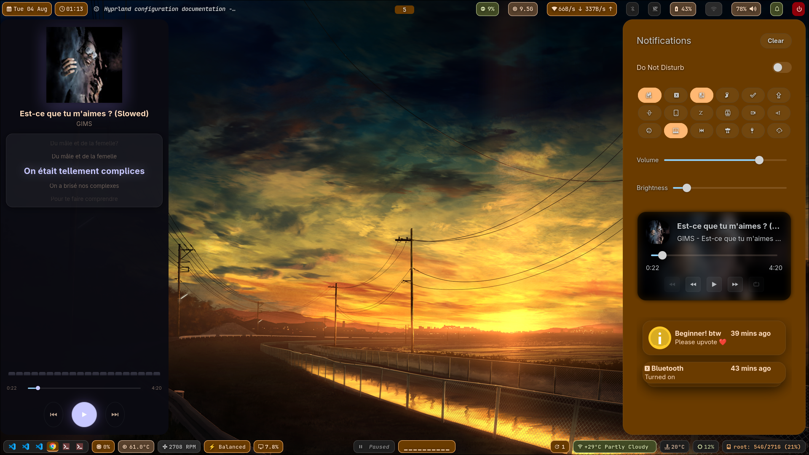

```
                  _              _                __    
__ __ ____ _ _  _| |__ _ _ _  __| |  __ ___ _ _  / _|___
\ V  V / _` | || | / _` | ' \/ _` | / _/ _ \ ' \|  _(_-<
 \_/\_/\__,_|\_, |_\__,_|_||_\__,_|_\__\___/_||_|_| /__/
             |__/                |___|                  
```

# wayland_confs — `hyprland_lp` branch

Personal Wayland desktop dotfiles for a **Hyprland** setup on Arch Linux, laptop variant (`lp` = laptop). Config lives directly under `~/.config`, so the layout of this repo mirrors that directory 1:1 — clone or symlink it into place.

## Overview

This branch is a Waybar-based rice: **Hyprland** as the compositor, **Waybar** (dual top + bottom bars) as the status bar, **rofi** as the launcher, **swaync** as the notification/control center, and **matugen** tying everything together with Material You (wallpaper-derived) color theming. `awww` handles animated wallpaper transitions, and `cava` provides a shader-backed audio visualizer feeding into Waybar.

## What's included

| Directory | Purpose |
|---|---|
| `hypr/` | Hyprland compositor config (`hyprland.conf`), `hypridle`, `hyprlock`, `hyprsunset`, plus helper scripts (weather strip, uptime for the lock screen) |
| `waybar/` | Top and bottom Waybar configs/styles, with scripts for a `cava` visualizer module, disk usage, network status, media (`playerctl`), and a system monitor |
| `matugen/` | Material You theme engine config — generates color schemes from the current wallpaper and pushes them out to every other app via templates |
| `rofi/` | App launcher config/theme (`type-1` launcher) plus a Wallhaven-backed wallpaper picker |
| `swaync/` | Notification center config/style and a large set of quick-toggle scripts (Wi-Fi, Bluetooth, airplane mode, mic, nightlight, powersaver, touchpad, keyboard backlight, screen recording, clipboard, caps/num lock indicators) |
| `kitty/` | Terminal config and matugen-generated color scheme |
| `cava/` | Audio visualizer config, GLSL shaders, and themes (including a live matugen theme) |
| `gtk-3.0/`, `gtk-4.0/`, `xsettingsd/`, `nwg-look/`, `dconf/` | GTK app theming and cursor/icon settings for a consistent look outside Hyprland-native apps |
| `Thunar/`, `xfce4/` | File manager keybindings, custom actions, and XFCE config helpers used alongside Thunar |
| `easyeffects/` | Audio effects presets |
| `btop/` | System monitor config |
| `environment.d/`, `autostart/`, `systemd/`, `menus/`, `mimeapps.list`, `user-dirs.*` | Session environment variables, autostart entries (e.g. `blueman`), merged app menus, and default file associations |

## Theming pipeline (matugen)

`matugen/config.toml` defines a `scheme-vibrant` Material You pipeline that runs whenever the wallpaper changes (bound to `SUPER SHIFT R` in Hyprland, via `matugen/scripts/wall.sh`):

1. Extracts a color scheme from the new wallpaper.
2. Sets the wallpaper itself through `awww` with a fade transition.
3. Renders color templates out to Hyprland, kitty, rofi, Waybar, GTK 3/4, cava, and swaync.
4. Live-reloads the affected apps (e.g. `swaync-client -rs` for swaync) so the whole desktop re-themes without a restart.

## Key keybinds (Hyprland)

| Bind | Action |
|---|---|
| `SUPER + Return` | Open kitty |
| `SUPER + Space` | rofi launcher (`drun`) |
| `SUPER SHIFT + D` | rofi custom launcher script |
| `SUPER + B` | Open Thunar |
| `SUPER + R` | Relaunch Waybar |
| `SUPER + L` | Lock screen (hyprlock) |
| `SUPER SHIFT + R` | Trigger matugen wallpaper/theme switch |
| `SUPER + F` | Fullscreen |
| `SUPER + 1–9` / `SUPER SHIFT + 1–9` | Switch / move to workspace |
| `SUPER + W/A/S/D` | Move focus |
| `Print` / `SUPER + Print` / `SHIFT + Print` | Screenshot (full / region / to file) |

See `hypr/hyprland.conf` for the full list, including brightness, volume, and window-resize binds.

## Notification center (swaync)

The `swaync/scripts` directory implements a set of paired `*-status.sh` / `*-toggle.sh` scripts that back Waybar/swaync quick-settings toggles for Wi-Fi, Bluetooth, airplane mode, microphone mute, nightlight, powersaver mode, touchpad, keyboard backlight, and screen recording — each polling live system state rather than assuming a static icon.

## Screenshots

```
┌──────────────────────────────────────────┐
│  ▄▄▄  ▄▄▄  ▄ ▄▄  ▄▄▄     ▄▄▄  ▄▄▄  ▄▄  ▄▄ │
│ █   █ █ █ █ █ █ █   █   █   █ █ █ █▀▀█   │
│ █▄▄▄▀ ▀▄█  █ █ █ █▄▄▄   █▄▄▄▀ █ █ █  █▄▄ │
└──────────────────────────────────────────┘
```



*swaync notification center — quick-settings grid, volume/brightness sliders, MPRIS media card with synced lyrics, and matugen-generated coloring pulled from the current wallpaper.*

> Add your own screenshots to a `screenshots/` folder at the repo root (e.g. `screenshots/notification-center.png`, `screenshots/waybar.png`, `screenshots/rofi.png`) and reference them here — GitHub renders them inline on the repo page.

## Requirements

- Arch Linux (or an Arch-based distro) with **Hyprland**
- `waybar`, `rofi`, `swaync`, `matugen`, `awww` (formerly `swww`), `hypridle`, `hyprlock`, `hyprsunset`
- `kitty`, `cava`, `btop`, `easyeffects`, `thunar` + `xfce4` helpers
- `playerctl`, `brightnessctl`, `pactl`/PipeWire, `grim` + `slurp` + `grimblast` for screenshots, `wl-clipboard`
- `nwg-look` and GTK theme tooling for GTK 3/4 consistency
- A Nerd Font for Waybar/rofi/kitty glyphs

## Usage

```bash
# Back up your existing config first
cp -r ~/.config ~/.config.bak

# Clone this branch
git clone -b hyprland_lp https://github.com/rbanik1204/wayland_confs.git /tmp/wayland_confs

# Copy or symlink individual app configs into place
cp -r /tmp/wayland_confs/hypr ~/.config/
cp -r /tmp/wayland_confs/waybar ~/.config/
# ...repeat for the directories you want, or copy everything at once:
cp -r /tmp/wayland_confs/* ~/.config/
```

Reload Hyprland (`hyprctl reload`) and relaunch Waybar (`SUPER + R`, or `~/.config/waybar/scripts/launch.sh`) after copying.

> **Note:** `pulse/` contains machine-specific PipeWire/PulseAudio device state (card database, volume, cookie) and isn't portable between machines — skip it when copying configs to a new system.

## Related branches

This repo tracks multiple iterations of the same desktop across branches/history — an earlier Waybar + swaync setup (this branch), a prior Fabric/Python-based Ax-Shell attempt, and ongoing work on a full custom Quickshell (QML/Qt Quick) shell. Check other branches for those variants.
